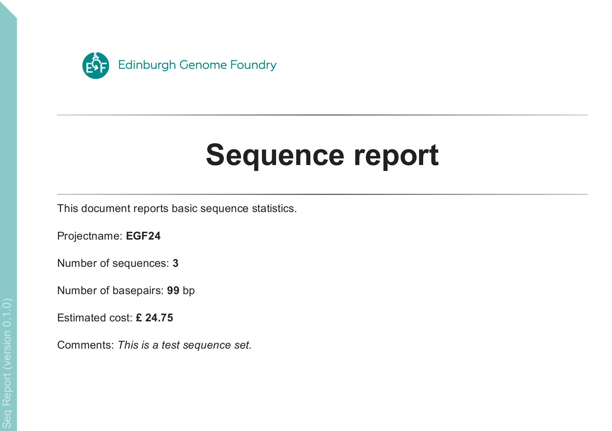

<p align="center">

</p>

# Seq Report

<!-- [](https://github.com/Edinburgh-Genome-Foundry/Seq_Report/actions/workflows/build.yml) -->

<!-- [](https://coveralls.io/github/Edinburgh-Genome-Foundry/Seq_Report?branch=main) -->

Simple reporting on a set of sequences for documentation purposes.

## Install

```bash
pip install git+https://github.com/Edinburgh-Genome-Foundry/Seq_Report.git
```

## Usage

```python
import seqreport

seq_fasta = "seq.fa"
seq_coll = seqreport.SeqCollection(fasta=seq_fasta, projectname="EGF24")
seqreport.write_pdf_report("seq_report.pdf", seq_coll)
```

<p align="center">

</p>

## Versioning

Seq Report uses the [semantic versioning](https://semver.org) scheme.

## License = MIT

Seq Report is free/libre and open-source software, which means the users have the freedom to run, study, change and distribute the software.

Seq Report was written at the [Edinburgh Genome Foundry](https://edinburgh-genome-foundry.github.io/)
by [Peter Vegh](https://github.com/veghp).

Copyright 2024 Edinburgh Genome Foundry, University of Edinburgh
